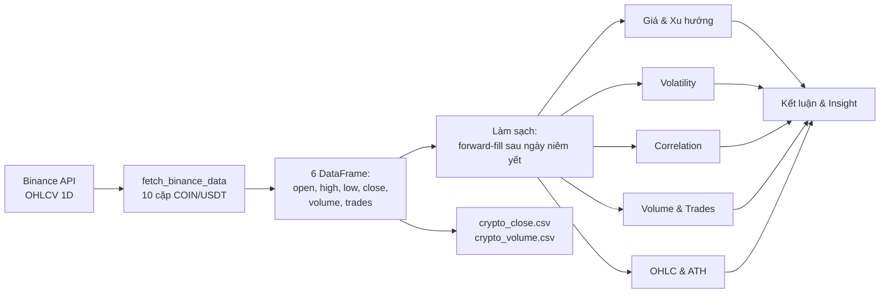

# Crypto EDA — Phân tích Top 10 đồng Coin trên Binance (2020–2024)

> Notebook phân tích khai phá dữ liệu (EDA) về giá, biến động, tương quan và thanh khoản của 10 đồng crypto hàng đầu, dựa trên dữ liệu OHLCV lịch sử lấy từ Binance API trong giai đoạn 01/01/2020 – 31/12/2024.

**Môn học:** Phân tích dữ liệu sử dụng Python — Thời gian chạy: khung ngày (1D)

---

## 📖 Giới thiệu

Dự án giải quyết các câu hỏi phân tích sau đối với thị trường crypto giai đoạn 2020–2024:

1. Coin nào tăng trưởng tốt nhất và kém nhất trong giai đoạn?
2. Coin nào có biến động giá lớn nhất, thể hiện rủi ro cao hơn?
3. Daily return của các altcoin có tương quan với BTC đến mức nào?
4. Volume giao dịch có đi kèm các ngày biến động giá mạnh hay không?
5. Việc một số coin (SOL, DOT, AVAX) niêm yết sau 01/01/2020 ảnh hưởng thế nào đến so sánh kết quả?

**Đối tượng sử dụng:** sinh viên, người học phân tích dữ liệu với Python, và bất kỳ ai muốn có một quy trình EDA hoàn chỉnh (thu thập → làm sạch → phân tích → insight) cho dữ liệu tài chính chuỗi thời gian.

> **Ghi chú phạm vi dữ liệu:** các coin niêm yết sau 01/01/2020 (SOL, DOT, AVAX) chỉ được phân tích từ ngày có dữ liệu thực tế; không dùng dữ liệu ngoài giai đoạn nghiên cứu để kết luận.

## ✨ Tính năng

Notebook gồm 9 phần, mỗi phần gắn với một câu hỏi phân tích cụ thể:

- **Thu thập dữ liệu tự động** — gọi Binance API lấy nến ngày (1D) cho 10 cặp COIN/USDT, có xử lý lỗi và rate-limit cho từng coin.
- **Kiểm tra chất lượng dữ liệu** — thống kê mô tả, báo cáo missing values (số ngày thiếu, % thiếu, ngày đầu có dữ liệu), biểu đồ missingno.
- **Làm sạch an toàn** — forward-fill chỉ áp dụng *sau* ngày coin niêm yết, giữ nguyên NaN trước ngày niêm yết để không tạo dữ liệu giả.
- **Phân tích giá & xu hướng** — giá đóng cửa kèm MA30, giá chuẩn hóa (gốc = 100, thang log), return theo từng năm.
- **Phân tích biến động** — phân phối daily return, rolling volatility 30 ngày, xếp hạng volatility trung bình theo coin.
- **Phân tích tương quan** — heatmap tương quan giá và tương quan daily return trên khoảng thời gian chung, scatter plot + hồi quy tuyến tính BTC vs từng altcoin.
- **Phân tích Volume & Trades** — volume theo thời gian, tương quan Spearman giữa log(Volume+1) và |Return|, so sánh volume/số giao dịch trung bình.
- **Phân tích OHLC & ATH** — candlestick BTC (180 ngày cuối), biên độ High–Low trong ngày, bảng ATH 2020–2024 và khoảng cách giá cuối 2024 so với ATH.
- **Tổng hợp kết luận** — bảng tăng trưởng tổng, volatility, tương quan Spearman với BTC và các insight kèm khuyến nghị hỗ trợ quyết định.

## 🛠️ Công nghệ sử dụng

| Thành phần | Thư viện / Công nghệ |
|---|---|
| Ngôn ngữ | Python 3 (notebook chạy trên kernel Python 3.14) |
| Lấy dữ liệu | [`python-binance`](https://github.com/sammchardy/python-binance) (Binance public API, không cần API key) |
| Xử lý dữ liệu | pandas, numpy |
| Trực quan hóa | matplotlib, seaborn, plotly (candlestick tương tác), missingno |
| Thống kê | scipy.stats (hồi quy tuyến tính), Spearman correlation của pandas |
| Định dạng | Jupyter Notebook, nbformat |

## 🏗️ Kiến trúc / Quy trình phân tích



Luồng xử lý: **Thu thập dữ liệu → Kiểm tra chất lượng → Làm sạch → 5 hướng phân tích song song → Tổng hợp kết luận**. Mỗi biểu đồ đều kèm nhận xét "Ý nghĩa phân tích" và "Quyết định hỗ trợ" ngay bên dưới.

## 📂 Cấu trúc thư mục

```
.
├── crypto_eda_v5.ipynb      # Notebook chính: toàn bộ quy trình phân tích (54 cells)
├── crypto_close.csv         # Giá đóng cửa hằng ngày 10 coin (1.827 dòng, 2020-01-01 → 2024-12-31)
├── crypto_volume.csv        # Volume giao dịch hằng ngày 10 coin (1.827 dòng)
├── images/                  # Các biểu đồ được xuất từ output của notebook
└── README.md
```

## ⚙️ Yêu cầu môi trường

- Python 3 (notebook được phát triển và chạy trên Python 3.14)
- Jupyter Notebook / JupyterLab / VS Code (có hỗ trợ .ipynb)
- Kết nối Internet để gọi Binance API (public data, **không cần API key**)

## 🚀 Cài đặt và chạy

```bash
# 1. Clone repository
git clone <URL-repository>
cd <thu-muc-project>

# 2. Cài các thư viện cần thiết (đã có sẵn ở cell đầu tiên của notebook)
pip install --upgrade python-binance pandas numpy matplotlib seaborn plotly scipy missingno nbformat

# 3. Mở notebook
jupyter notebook crypto_eda_v5.ipynb
```

Sau đó chạy **Run All** để thực thi toàn bộ pipeline: lấy dữ liệu từ Binance → làm sạch → sinh toàn bộ biểu đồ và bảng kết quả. Notebook có bước cài thư viện bằng `%pip install` ngay ở cell đầu tiên nên có thể chạy trực tiếp trên môi trường mới.

> Nếu không muốn gọi lại API, hai file `crypto_close.csv` và `crypto_volume.csv` trong repo đã chứa giá đóng cửa và volume sẵn để tham khảo.

## 🔐 Cấu hình

Toàn bộ cấu hình nằm ở cell "Cấu hình danh sách coin" trong notebook:

| Tham số | Giá trị mặc định | Ý nghĩa |
|---|---|---|
| `COINS_BINANCE` | 10 cặp `COINUSDT` | Danh sách cặp giao dịch lấy từ Binance |
| `START_DATE` | `"1 Jan, 2020"` | Đầu giai đoạn nghiên cứu |
| `END_DATE` | `"31 Dec, 2024"` | Cuối giai đoạn nghiên cứu |
| `EXPECTED_COINS` | `10` | Kiểm tra lấy đủ 10 coin, thiếu sẽ raise lỗi |

Dự án **không yêu cầu** API key, secret, file `.env` hay biến môi trường nào vì chỉ dùng Binance public data.

## 🗄️ Dữ liệu

Không dùng cơ sở dữ liệu; dữ liệu dạng bảng pandas + CSV.

**10 coin được phân tích:**

| # | Coin | Symbol | Ngày niêm yết Binance | Nhóm |
|---|---|---|---|---|
| 1 | Bitcoin | BTC | 2017-08 | Benchmark thị trường |
| 2 | Ethereum | ETH | 2017-08 | Smart contract |
| 3 | BNB | BNB | 2017-11 | Coin sàn giao dịch |
| 4 | XRP | XRP | 2018-05 | Thanh toán quốc tế |
| 5 | Cardano | ADA | 2018-04 | Blockchain thế hệ 3 |
| 6 | Dogecoin | DOGE | 2019-07 | Meme coin |
| 7 | Solana | SOL | 2020-08 | Blockchain hiệu năng cao |
| 8 | Polkadot | DOT | 2020-08 | Cross-chain protocol |
| 9 | Avalanche | AVAX | 2020-09 | Hệ sinh thái DeFi |
| 10 | Chainlink | LINK | 2019-01 | Oracle |

**Cấu trúc dữ liệu:** mỗi dòng là một ngày giao dịch; các cột gồm `date`, `open`, `high`, `low`, `close`, `volume`, `trades` (đầy đủ OHLCV trong notebook; 2 file CSV xuất ra gồm close và volume). SOL/DOT/AVAX có NaN trước ngày niêm yết và được xử lý riêng trong bước làm sạch.

## 📊 Kết quả chính & Biểu đồ

Một số biểu đồ tiêu biểu được xuất sẵn trong thư mục [`images/`](images/):

| | |
|---|---|
|  |  |
|  |  |
|  |  |

Các phân tích định lượng notebook tự in ở phần Kết luận: tăng trưởng tổng từ ngày đầu có dữ liệu đến 31/12/2024, volatility (độ lệch chuẩn daily return), tương quan Spearman với BTC, và bảng ATH 2020–2024 kèm khoảng cách % của giá cuối 2024 so với đỉnh.

## 📚 Cách sử dụng

1. Mở `crypto_eda_v5.ipynb`, chạy cell cài thư viện và import.
2. Chạy phần **Thu thập dữ liệu** để tải OHLCV từ Binance (mỗi coin nghỉ 0.5s giữa các lần gọi; thiếu coin nào sẽ báo lỗi rõ ràng).
3. Chạy tiếp **Kiểm tra chất lượng & Làm sạch** để xem báo cáo missing values và forward-fill an toàn.
4. Chạy các phần 4–8 để sinh lần lượt biểu đồ giá, volatility, correlation, volume, OHLC/ATH — mỗi biểu đồ kèm nhận xét diễn giải.
5. Đọc phần **Kết luận & Insight** để xem tổng hợp kết quả định lượng và các khuyến nghị hỗ trợ quyết định.

## ⚠️ Lưu ý

- **Không so sánh trực tiếp tổng lợi nhuận** của SOL/DOT/AVAX với BTC/ETH vì độ dài chuỗi dữ liệu khác nhau (3 coin này chỉ có dữ liệu từ 2020-08/09) — notebook đã nêu rõ giới hạn này.
- Cell lấy dữ liệu cần **Internet**; nếu Binance API từ chối kết nối hoặc thiếu coin, hàm sẽ raise `RuntimeError` kèm danh sách coin lỗi thay vì phân tích trên dữ liệu thiếu.
- Notebook dùng `warnings.filterwarnings("ignore")` và `%pip install` ở cell đầu — nếu chạy trên môi trường chia sẻ (Colab/Kaggle) hãy kiểm tra lại phiên bản thư viện.
- Các nhận định "Quyết định hỗ trợ" trong notebook là tham khảo từ dữ liệu lịch sử, không phải khuyến nghị đầu tư.

## 👨‍💻 Thành viên

- LeoUrion - Nguyen Quoc Chuye

